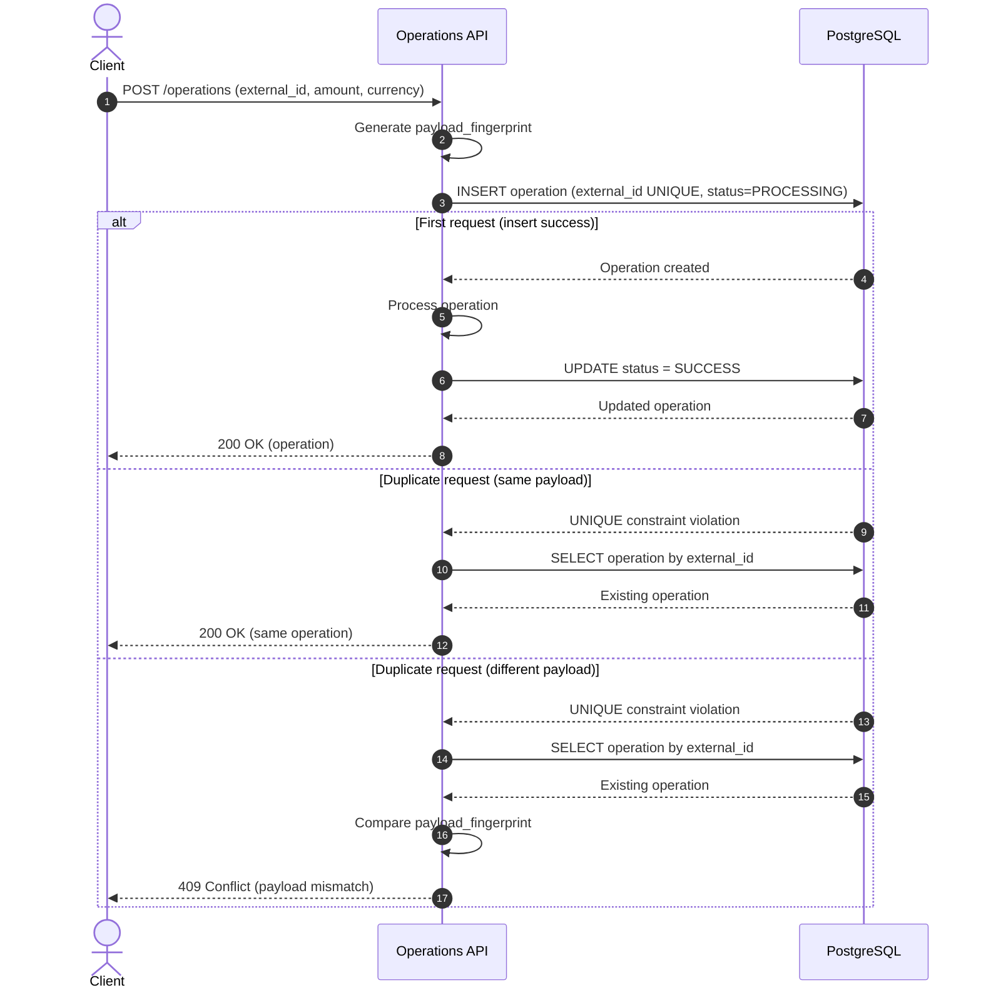

## Desafio TechFX – Operations API
### Contexto

Este projeto implementa um endpoint responsável por processar operações financeiras recebidas via API.
O sistema foi desenhado para lidar corretamente com requisições duplicadas, comuns em cenários de retry de webhook, timeouts de rede e chamadas concorrentes.
O foco da solução é garantir idempotência, consistência e segurança dos dados, especialmente em um contexto financeiro.

### Endpoint
`POST /operations`

#### Payload:

```json
{
  "external_id": "ext-1234",
  "amount": 100.50,
  "currency": "BRL"
}
```

### Abordagem 

- O diagrama abaixo demonstra como o sistema garante idempotência e consistência mesmo em cenários de chamadas duplicadas e concorrentes, utilizando o banco de dados como fonte de verdade.




#### Idempotência

- O campo `external_id` é tratado como chave de idempotência.
- Existe uma constraint UNIQUE no banco de dados para `external_id`.
- O fluxo segue o padrão “insert first, handle conflict”, evitando race conditions.

Isso garante que:

- múltiplas requisições concorrentes não gerem duplicidade
- retries retornem sempre o mesmo resultado

#### Concorrência

- A concorrência é resolvida no nível do banco de dados, e não na aplicação.
- Não são utilizados locks em memória ou estruturas locais, permitindo escala horizontal segura.
- O PostgreSQL atua como fonte de verdade para consistência.

#### Integridade do payload

Além da idempotência, a solução protege contra reutilização incorreta do `external_id`:

- É gerado um payload_fingerprint (hash SHA-256 de `external_id`, `amount` e `currency`)
- Em chamadas subsequentes:
  - se o hash for igual → idempotência válida
  - se o hash for diferente → conflito explícito (409 Conflict)
  
Isso evita erros silenciosos em cenários financeiros críticos.

#### Reprocessamento

- Existe o campo `reprocessed_at` para suportar reprocessamentos futuros.
- O reprocessamento não é automático e deve ser uma ação manual (ou posteriormente feita uma automação)
- Isso preserva rastreabilidade e auditoria.

### Trade-offs
#### Decisões tomadas

- Uso de PostgreSQL com constraint única para garantir consistência e que não tenha dados duplicados
- Simplicidade arquitetural, evitando overengineering, aqui decidi realizar uma abordagem simples, mas futuramente podendo
ter replicas de banco (escrita e leitura) e a inserção não ser sync e sim async, trabalhando com filas, por exemplo um SQS.

#### O que não foi implementado (intencionalmente)

- Fila assíncrona
- Worker separado
- Saga / Outbox
- Cache distribuído

Esses elementos seriam considerados em cenários de maior escala, mas não são necessários para o escopo do desafio.


### Escalabilidade

A solução permite escalar horizontalmente porque:

- não depende de estado em memória
- a idempotência é garantida no banco
- múltiplas instâncias podem processar requisições simultaneamente com segurança

Evoluções naturais em cenários de alto volume:

- processamento assíncrono via filas
- particionamento por external_id
- leitura via réplicas

### Falhas e resiliência

- Se a aplicação cair após o insert, a operação permanece registrada como PROCESSING
- O estado persistido permite retentativas seguras
- A abordagem evita processamento duplicado mesmo sob falhas parciais

## Como executar localmente

### Subir o postgres
```shell
docker compose up -d
```

### Rodar a aplicação

````shell
cp -r .env.example .env
````

````shell
npm install
npm run start:local
````

### Teste rapido
````shell
curl -X POST http://localhost:3025/operations \
  -H "Content-Type: application/json" \
  -d '{
    "external_id": "op-123",
    "amount": 100,
    "currency": "BRL"
  }'

````

